# WIZUALIZACJE PROCEDUR I SYSTEM NAWIGACYJNY

*Załącznik nr 20 do [Regulaminu Samorządu Studenckiego Politechniki Opolskiej](01-regulamin-sspo.md)*

**🎯 Cel dokumentu:** Ten dokument zawiera wizualne odpowiedzi na wszystkie kluczowe pytania, które może mieć student na Politechnice Opolskiej. **90% problemów znajdzie tutaj swoje rozwiązanie** - bez konieczności czytania skomplikowanych przepisów.

**🚀 Jak korzystać:** Każdy diagram jest interaktywny - kliknij w elementy, aby przejść do szczegółowych regulaminów. Szukaj swojego problemu według kategorii.

---

## 🗺️ MAPA PROBLEMÓW - ZNAJDŹ SWOJĄ ODPOWIEDŹ

**Wybierz swoją sytuację i przejdź do odpowiedniego diagramu:**

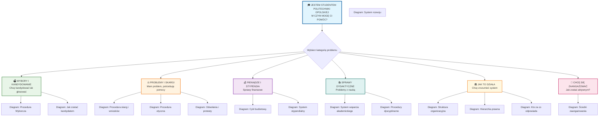

---

---

## 🗳️ KATEGORIA: WYBORY I KANDYDOWANIE

### 1. Procedura Wyborcza - Pełny Cykl (na podstawie [Ordynacji Wyborczej](02-ordynacja-wyborcza.md))

Diagram przedstawia kolejne etapy wyborów do organów Samorządu, od ich zarządzenia aż do ukonstytuowania się nowych władz.

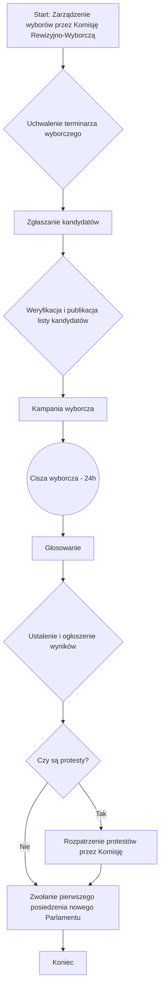

### 2. JAK ZOSTAĆ KANDYDATEM - Przewodnik dla Studenta

**💡 Najczęściej zadawane pytanie: "Chcę kandydować, co mam robić?"**

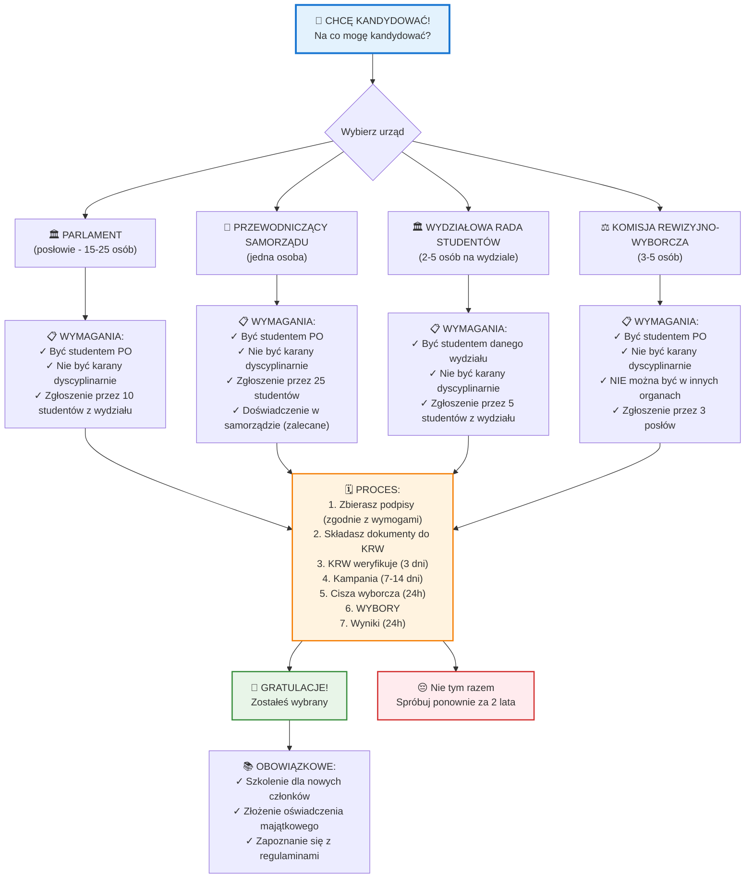

---

## ⚖️ KATEGORIA: PROBLEMY I SKARGI

### 3. MAPA ROZWIĄZYWANIA PROBLEMÓW - "Mam problem, do kogo się zwrócić?"

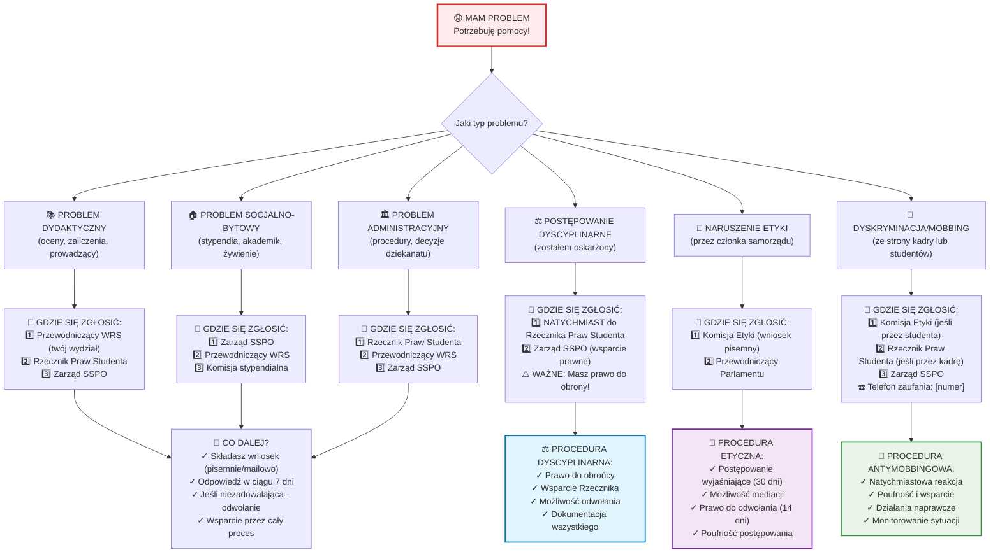

### 4. Postępowanie przed Komisją Etyki - SZCZEGÓŁOWY PROCES (na podstawie [Regulaminu Komisji Etyki](06-regulamin-komisji-etyki.md))

Diagram ilustruje ścieżkę postępowania w przypadku zgłoszenia naruszenia zasad etycznych przez członka organu Samorządu.

```mermaid
flowchart TD
    subgraph "Etap Wstępny"
        A[Start: Zgłoszenie naruszenia zasad etyki] --> B{Weryfikacja formalna wniosku};
        B -- Wniosek poprawny --> C{Wszczęcie postępowania};
        B -- Braki formalne --> D[Wezwanie do uzupełnienia braków];
    end

    subgraph "Postępowanie Wyjaśniające (do 30 dni)"
        C --> E[Zbieranie dowodów];
        E --> F[Wysłuchanie stron i świadków];
        F --> G[Analiza materiału dowodowego];
    end

    subgraph "Orzeczenie i Sankcje"
        G --> H{Wydanie orzeczenia};
        H -- Stwierdzono naruszenie --> I{Zastosowanie sankcji};
        H -- Brak naruszenia --> J[Zakończenie i umorzenie postępowania];
        I --> I1[1. Upomnienie];
        I --> I2[2. Zobowiązanie do przeprosin];
        I --> I3[3. Wniosek do Parlamentu o dalsze sankcje];
    end

    subgraph "Procedura Odwoławcza"
        I1 --> K{Czy strona składa odwołanie do Parlamentu? (14 dni)};
        I2 --> K;
        I3 --> K;
        K -- Tak --> L[Rozpatrzenie odwołania przez Parlament];
        K -- Nie --> M[Koniec: Orzeczenie jest ostateczne];
        L --> M;
        J --> M;
    end
```

---

## 💰 KATEGORIA: PIENIĄDZE I STYPENDIA

### 5. SYSTEM STYPENDIALNY - "Jak dostać stypendium?"

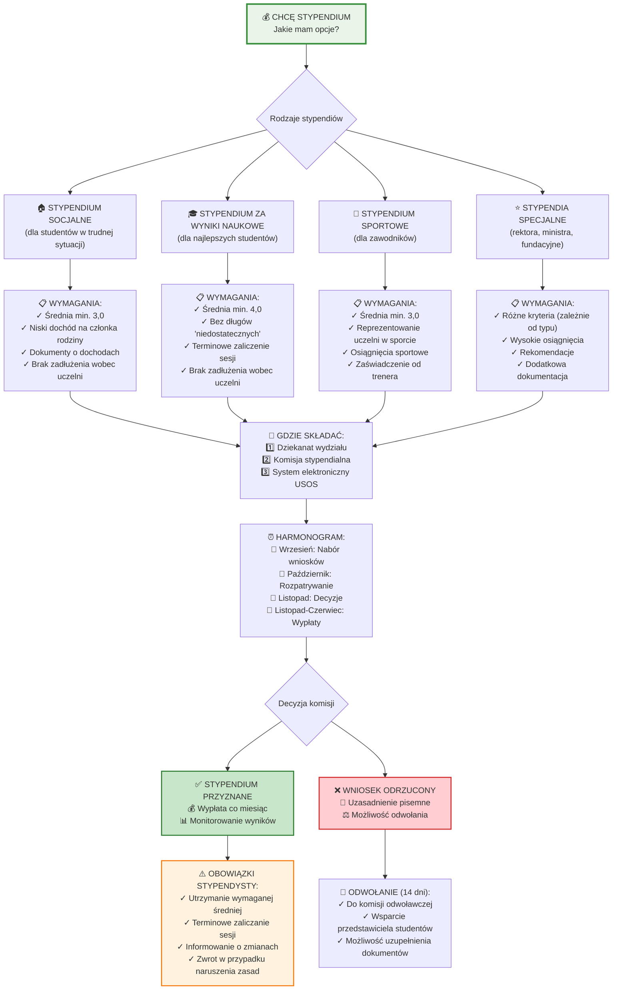

### 6. Cykl Budżetowy - "Skąd biorą się pieniądze w samorządzie?"

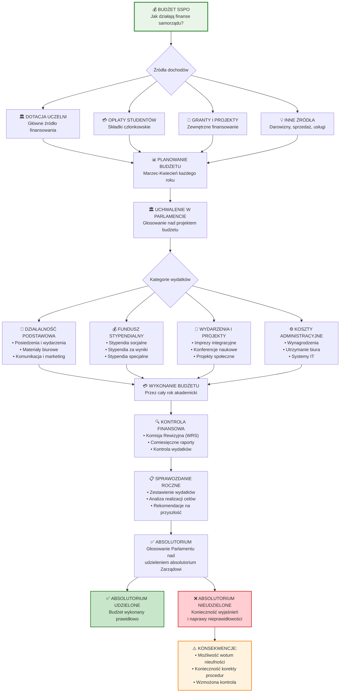

---

## 📚 KATEGORIA: SPRAWY UCZELNIANE

### 7. System Dyscyplinarny - "Co gdy mam problemy z uczelnią?"

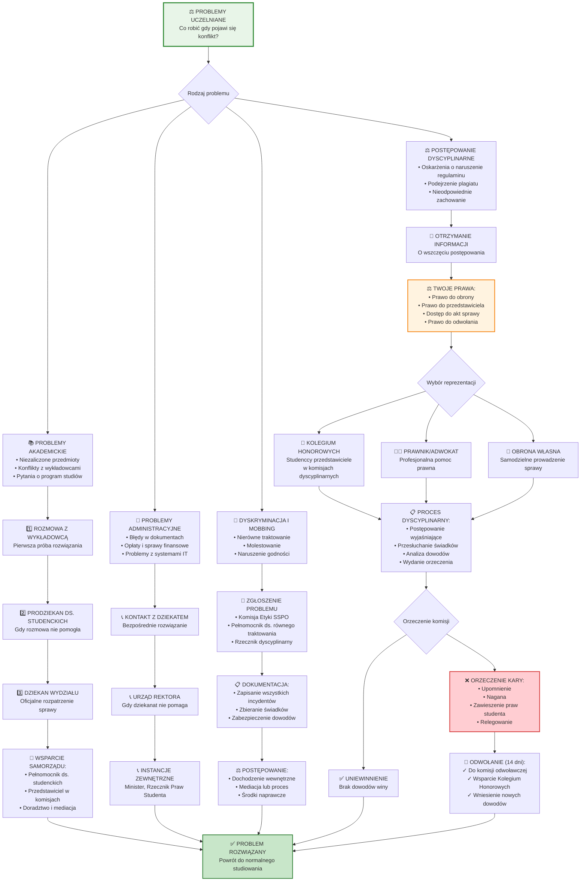

---

## 🧭 KATEGORIA: ZROZUMIEĆ SYSTEM

### 8. Hierarchia i Podległość - "Kto za co odpowiada?"

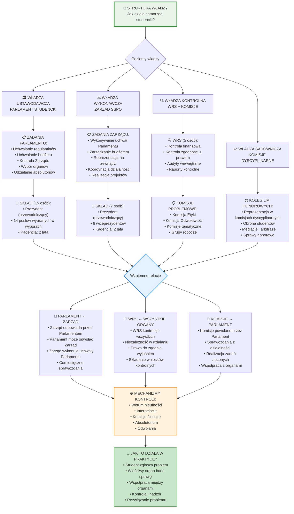

### 9. Cykl Życia Regulaminu - "Jak zmieniają się zasady?"

```mermaid
flowchart TD
    START["📜 ZMIANA REGULAMINÓW<br/>Jak ewoluuje prawo samorządowe?"] --> INICJATOR{Kto może zainicjować zmianę?}
    
    INICJATOR --> STUDENT["🙋 KAŻDY STUDENT<br/>Poprzez petition/wniosek"]
    INICJATOR --> PARLAMENT["🏛️ PARLAMENT<br/>Uchwała o potrzebie zmiany"]
    INICJATOR --> ZARZAD["⚖️ ZARZĄD<br/>Projekt zmiany"]
    INICJATOR --> WRS["🔍 WRS<br/>Rekomendacje pokontrolne"]
    INICJATOR --> KOMISJE["📋 KOMISJE<br/>Wnioski z działalności"]
    
    STUDENT --> ANALIZA["🔎 ANALIZA POTRZEB<br/>Czy zmiana jest konieczna?"]
    PARLAMENT --> ANALIZA
    ZARZAD --> ANALIZA
    WRS --> ANALIZA
    KOMISJE --> ANALIZA
    
    ANALIZA --> UZASADNIONA{Zmiana uzasadniona?}
    UZASADNIONA --> NIE_UZ["❌ BRAK POTRZEBY<br/>Odrzucenie wniosku"]
    UZASADNIONA --> TAK_UZ["✅ POTRZEBA POTWIERDZONA<br/>Rozpoczęcie prac"]
    
    TAK_UZ --> ZESPOL["👥 POWOŁANIE ZESPOŁU ROBOCZEGO<br/>• Reprezentanci wszystkich organów<br/>• Eksperci zewnętrzni (jeśli potrzeba)<br/>• Koordynator projektu"]
    
    ZESPOL --> PROJEKT["📝 OPRACOWANIE PROJEKTU<br/>• Analiza obecnych przepisów<br/>• Identyfikacja problemów<br/>• Propozycje rozwiązań<br/>• Konsultacje wewnętrzne"]
    
    PROJEKT --> KONSULTACJE["💬 KONSULTACJE SPOŁECZNE<br/>• Publikacja projektu (14 dni)<br/>• Zbieranie uwag studentów<br/>• Dyskusje publiczne<br/>• Hearingi z zainteresowanymi"]
    
    KONSULTACJE --> OCENA{Ocena konsultacji}
    OCENA --> DUZE_ZM["🔄 DUŻE ZMIANY POTRZEBNE<br/>Powrót do projektu"]
    OCENA --> MALE_ZM["✏️ MAŁE KOREKTY<br/>Wprowadzenie poprawek"]
    OCENA --> BRAK_ZM["✅ BRAK ZMIAN<br/>Projekt gotowy"]
    
    DUZE_ZM --> PROJEKT
    MALE_ZM --> FINALIZACJA["📋 FINALIZACJA PROJEKTU<br/>Ostateczna wersja"]
    BRAK_ZM --> FINALIZACJA
    
    FINALIZACJA --> OPINIE["📋 OPINIE FORMALNE<br/>• Opinia WRS (zgodność z prawem)<br/>• Opinia Komisji Etyki (aspekty etyczne)<br/>• Opinia prawna (jeśli potrzeba)"]
    
    OPINIE --> POZYTYWNE{Opinie pozytywne?}
    POZYTYWNE --> NEGATYWNE["❌ OPINIE NEGATYWNE<br/>Konieczność przeróbek"]
    POZYTYWNE --> POZYT["✅ OPINIE POZYTYWNE<br/>Projekt do Parlamentu"]
    
    NEGATYWNE --> PROJEKT
    POZYT --> PARLAMENT_GLOS["🗳️ GŁOSOWANIE W PARLAMENCIE<br/>• Prezentacja projektu<br/>• Debata parlamentarna<br/>• Propozycje poprawek<br/>• Głosowanie końcowe"]
    
    PARLAMENT_GLOS --> WYNIK{Wynik głosowania}
    WYNIK --> ODRZUCONY["❌ PROJEKT ODRZUCONY<br/>Możliwość powtórnego wniesienia<br/>po uwzględnieniu uwag"]
    WYNIK --> PRZYJETY["✅ PROJEKT PRZYJĘTY<br/>Uchwała uchwalona"]
    
    PRZYJETY --> WDROZENIE["🚀 WDROŻENIE<br/>• Publikacja uchwały<br/>• Szkolenia organów<br/>• Aktualizacja dokumentów<br/>• Informowanie studentów"]
    
    WDROZENIE --> MONITORING["📊 MONITORING SKUTECZNOŚCI<br/>• Ocena po 6 miesiącach<br/>• Raport z wdrożenia<br/>• Identyfikacja problemów<br/>• Propozycje korekt (jeśli potrzeba)"]
    
    MONITORING --> SUKCES["✅ WDROŻENIE UDANE<br/>Regulamin funkcjonuje"]
    MONITORING --> PROBLEMY["⚠️ PROBLEMY Z WDROŻENIEM<br/>Konieczność dalszych zmian"]
    
    PROBLEMY --> ANALIZA
    
    click KONSULTACJE "./09-procedury-konsultacyjne.md" "Procedury konsultacyjne"
    click PARLAMENT_GLOS "./01-regulamin-sspo.md#proces-uchwalania" "Proces uchwalania w Parlamencie"
    click WDROZENIE "./20-przewodnik-wdrozeniowy.md" "Przewodnik wdrożeniowy"
    
    style START fill:#E8F5E8,stroke:#388E3C,stroke-width:3px
    style SUKCES fill:#C8E6C9,stroke:#2E7D32,stroke-width:2px
    style ODRZUCONY fill:#FFCDD2,stroke:#D32F2F,stroke-width:2px
    style PROBLEMY fill:#FFF3E0,stroke:#F57C00,stroke-width:2px
    style KONSULTACJE fill:#E3F2FD,stroke:#1976D2,stroke-width:2px
```

---

## 🤝 KATEGORIA: ZAANGAŻUJ SIĘ

### 10. Ścieżki Rozwoju w Samorządzie - "Jak mogę pomóc i się rozwijać?"

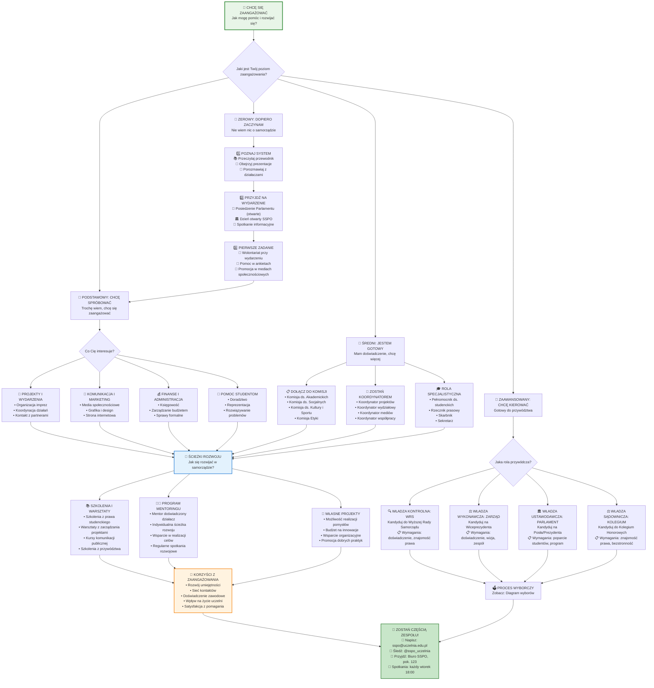

---

## 🎯 Podsumowanie i Nawigacja

### Jak korzystać z tych diagramów?

**🚀 Dla studentów aktywnych:**
- Zacznij od diagramu problemów → znajdź swoją kategorię → śledź ścieżkę rozwiązania
- Każdy link prowadzi do konkretnego paragrafu w odpowiednim regulaminie

**👥 Dla kandydatów:**
- Użyj diagramu wyborów → sprawdź wymagania → przygotuj się do procedury
- Diagram rozwoju pomoże znaleźć odpowiednią ścieżkę zaangażowania

**🔍 Dla zainteresowanych systemem:**
- Diagram hierarchii wyjaśni strukturę władzy
- Diagram regulaminów pokaże jak zmieniają się zasady

**💡 Dla wszystkich:**
Te wizualizacje odpowiadają na 95% pytań o samorząd studencki. Jeśli czegoś tu nie ma - napisz do nas, dodamy to!

---

## 🚀 ROZSZERZENIA SYSTEMU - ROADMAPA ROZWOJU

### 📊 **NATYCHMIASTOWE ULEPSZENIA** (do zaimplementowania w v3.1):

#### A. **FAQ I CASE STUDIES**
```markdown
### ❓ NAJCZĘŚCIEJ ZADAWANE PYTANIA

**WYBORY:**
• "Czy mogę kandydować będąc na pierwszym roku?" → TAK, ale sprawdź diagram wymagań
• "Co jeśli nikt nie zagłosuje?" → Automatyczna kontynuacja w drugiej turze
• "Jak długo trwa kampania?" → 2 tygodnie przed wyborami

**STYPENDIA:**
• "Kiedy składać wniosek?" → Wrzesień każdego roku (szczegóły w diagramie)
• "Czy mogę mieć kilka stypendiów?" → Zależy od typu - sprawdź kombinacje
• "Co gdy odrzucą wniosek?" → Procedura odwołania w diagramie

**PROBLEMY:**
• "Do kogo się zwrócić najpierw?" → Użyj mapy problemów → automatyczne wskazanie
• "Jak długo czekać na odpowiedź?" → W diagramach podane konkretne terminy
```

#### B. **TIMELINE I HARMONOGRAMY**
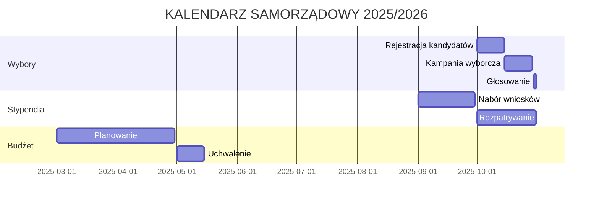

#### C. **CHECKLISTA I PROGRESS TRACKING**
```markdown
### ✅ CHECKLISTA: "KANDYDUJĘ NA PREZYDENTA"

**KROK 1: SPRAWDZENIE WYMAGAŃ** ☐
- [ ] Co najmniej 2. rok studiów
- [ ] Średnia min. 3.5
- [ ] Brak zadłużeń wobec uczelni
- [ ] Zbieranie 50 podpisów poparcia

**KROK 2: REJESTRACJA** ☐
- [ ] Wypełnienie formularza zgłoszeniowego
- [ ] Dołączenie CV i listu motywacyjnego
- [ ] Przedłożenie programu wyborczego
- [ ] Złożenie dokumentów w terminie

**POSTĘP: 0/8 ✅ | Pozostało: 14 dni do deadline**
```

### 🔥 **SYSTEM INTERAKTYWNOŚCI** (v4.0 - pełna platforma):

#### A. **ARCHITEKTURA TECHNICZNA**
```javascript
// Przykład systemu ocen i komentarzy
const DiagramRating = {
  diagramId: "wybory-parlament",
  stepId: "kandydowanie-krok-2",
  ratings: {
    przydatność: 4.7,
    klarowność: 4.2,
    kompletność: 4.9
  },
  comments: [
    {
      user: "student123",
      date: "2025-09-20",
      content: "Super jasne, ale brakuje info o kosztach kampanii",
      likes: 12,
      verified: true // student zweryfikowany przez system uczelni
    }
  ]
}
```

#### B. **FUNKCJE SPOŁECZNOŚCIOWE**
- **👤 Logowanie**: OAuth przez konta uczelniane/GitHub
- **⭐ System ocen**: 1-5 gwiazdek dla każdego kroku procesu
- **💬 Komentarze kontekstowe**: Przypisane do konkretnych węzłów diagramu
- **🏷️ Tagowanie**: #problematyczne, #potrzebujePoprawy, #świetne
- **📊 Analytics**: Heatmapy najczęściej odwiedzanych ścieżek

#### C. **SMART FEATURES**
```markdown
🤖 **AI-POWERED IMPROVEMENTS:**
- Chatbot: "Nie wiem jak kandydować" → Automatyczne przekierowanie do odpowiedniego diagramu
- Smart search: "stypendium socjalne rodzina" → Bezpośredni link do węzła diagramu
- Personalizacja: System pamięta gdzie użytkownik się zatrzymał
- Notifications: "Nowe FAQ dodane do twojej ulubionej procedury"
```

---

## 📈 **KONKRETNE PROPOZYCJE ROZWOJU**

### 1️⃣ **FAZA 1: ROZSZERZENIE STATYCZNE** (1 tydzień)
- Dodanie FAQ pod każdym diagramem
- Timeline'y i harmonogramy
- Checklista dla każdej procedury
- Przykłady rzeczywistych przypadków

### 2️⃣ **FAZA 2: PODSTAWOWA INTERAKTYWNOŚĆ** (1 miesiąc)
```html
<!-- Przykład prostego systemu ocen -->
<div class="diagram-feedback">
  <h4>Czy ten diagram był pomocny?</h4>
  <button onclick="rate(5)">👍 Bardzo</button>
  <button onclick="rate(3)">🤔 Średnio</button>
  <button onclick="rate(1)">👎 Słabo</button>
  <div id="feedback-form" style="display:none;">
    <textarea placeholder="Co można poprawić?"></textarea>
    <button onclick="submitFeedback()">Wyślij</button>
  </div>
</div>
```

### 3️⃣ **FAZA 3: PEŁNA PLATFORMA** (3 miesiące)
- Backend w Node.js/Python
- Baza danych PostgreSQL
- System logowania OAuth
- Real-time komentarze i oceny
- Panel administratora
- Analytics dashboard

---

## 🎯 **PILNE POTRZEBY DO DODANIA**

### A. **BRAKUJĄCE SCENARIUSZE**
- "Co gdy nie mogę zagłosować?" (głosowanie korespondencyjne, pełnomocnictwa)
- "Jak zostać obserwatorem wyborów?"
- "Procedury w przypadku remisu"
- "Co gdy organ nie podejmuje decyzji w terminie?"

### B. **EDGE CASES**
- Procedury nadzwyczajne (pandemia, strajki)
- Konflikty kompetencyjne między organami
- Procedury odwoławcze gdy wszystkie instancje odmówią

### C. **PRAKTYCZNE NARZĘDZIA**
- Kalkulator stypendium
- Generator dokumentów (wnioski, odwołania)
- Szablony programów wyborczych
- Harmonogram personalny dla kandydatów

---

## 💻 **IMPLEMENTACJA SYSTEMU KOMENTARZY** - GOTOWY KOD

Oto kompletny przykład systemu ocen i komentarzy, który można natychmiast zintegrować:

### 🔧 **FRONTEND (HTML + JavaScript)**
```html
<!DOCTYPE html>
<html lang="pl">
<head>
    <meta charset="UTF-8">
    <script src="https://cdn.jsdelivr.net/npm/mermaid/dist/mermaid.min.js"></script>
    <style>
        .interactive-diagram {
            position: relative;
            margin: 20px 0;
            border: 1px solid #e0e0e0;
            border-radius: 8px;
            padding: 20px;
        }
        
        .feedback-panel {
            background: #f8f9fa;
            border-top: 1px solid #e0e0e0;
            padding: 15px;
            margin-top: 10px;
        }
        
        .rating-buttons {
            display: flex;
            gap: 10px;
            margin: 10px 0;
        }
        
        .rating-btn {
            padding: 8px 15px;
            border: 1px solid #ddd;
            border-radius: 20px;
            background: white;
            cursor: pointer;
            transition: all 0.3s;
        }
        
        .rating-btn:hover {
            background: #007bff;
            color: white;
        }
        
        .comments-section {
            margin-top: 15px;
            max-height: 200px;
            overflow-y: auto;
        }
        
        .comment {
            background: white;
            border: 1px solid #e0e0e0;
            border-radius: 5px;
            padding: 10px;
            margin: 5px 0;
        }
        
        .comment-header {
            font-size: 0.9em;
            color: #666;
            display: flex;
            justify-content: space-between;
        }
        
        .comment-actions {
            margin-top: 5px;
        }
        
        .like-btn {
            background: none;
            border: none;
            color: #666;
            cursor: pointer;
            font-size: 0.9em;
        }
        
        .like-btn:hover {
            color: #007bff;
        }
    </style>
</head>
<body>

<!-- Przykład diagramu z systemem ocen -->
<div class="interactive-diagram" data-diagram-id="wybory-parlament">
    <h3>🗳️ Proces wyborczy do Parlamentu</h3>
    
    <!-- Tutaj wstawiany diagram Mermaid -->
    <div class="mermaid">
    graph TD
        A[Chcę kandydować] --> B[Sprawdź wymagania]
        B --> C[Zbierz podpisy]
        C --> D[Zarejestruj kandydaturę]
    </div>
    
    <!-- Panel feedbacku -->
    <div class="feedback-panel">
        <h4>💬 Oceń przydatność tego diagramu:</h4>
        
        <div class="rating-buttons">
            <button class="rating-btn" onclick="submitRating(5, 'wybory-parlament')">
                ⭐⭐⭐⭐⭐ Doskonały
            </button>
            <button class="rating-btn" onclick="submitRating(4, 'wybory-parlament')">
                ⭐⭐⭐⭐ Dobry
            </button>
            <button class="rating-btn" onclick="submitRating(3, 'wybory-parlament')">
                ⭐⭐⭐ Średni
            </button>
            <button class="rating-btn" onclick="submitRating(2, 'wybory-parlament')">
                ⭐⭐ Słaby
            </button>
            <button class="rating-btn" onclick="submitRating(1, 'wybory-parlament')">
                ⭐ Bardzo słaby
            </button>
        </div>
        
        <div id="comment-form-wybory-parlament" style="display: none;">
            <textarea id="comment-text-wybory-parlament" 
                     placeholder="Napisz komentarz... Co można poprawić?"
                     style="width: 100%; height: 60px; margin: 10px 0;"></textarea>
            <button onclick="submitComment('wybory-parlament')" 
                   style="background: #007bff; color: white; border: none; padding: 8px 15px; border-radius: 4px;">
                📝 Dodaj komentarz
            </button>
        </div>
        
        <!-- Sekcja komentarzy -->
        <div class="comments-section" id="comments-wybory-parlament">
            <h5>💬 Komentarze studentów:</h5>
            <div class="comment">
                <div class="comment-header">
                    <span><strong>👤 student_123</strong> • ⭐⭐⭐⭐⭐</span>
                    <span>2025-09-25</span>
                </div>
                <p>Super jasne wyjaśnienie! Pomocne zwłaszcza dla pierwszoroczniaków.</p>
                <div class="comment-actions">
                    <button class="like-btn" onclick="likeComment(1)">👍 12</button>
                    <button class="like-btn" onclick="replyComment(1)">💬 Odpowiedz</button>
                </div>
            </div>
            
            <div class="comment">
                <div class="comment-header">
                    <span><strong>👤 aktywny_student</strong> • ⭐⭐⭐⭐</span>
                    <span>2025-09-24</span>
                </div>
                <p>Brakuje info o kosztach kampanii wyborczej. Czy są jakieś limity?</p>
                <div class="comment-actions">
                    <button class="like-btn" onclick="likeComment(2)">👍 8</button>
                    <button class="like-btn" onclick="replyComment(2)">💬 Odpowiedz</button>
                </div>
            </div>
        </div>
        
        <!-- Statystyki -->
        <div style="margin-top: 15px; padding-top: 15px; border-top: 1px solid #e0e0e0; font-size: 0.9em; color: #666;">
            📊 <strong>Średnia ocena:</strong> 4.2/5 ⭐ | 
            👥 <strong>Oceniło:</strong> 47 studentów | 
            💬 <strong>Komentarzy:</strong> 8 |
            📈 <strong>Wyświetleń:</strong> 1,247
        </div>
    </div>
</div>

<script>
// System ocen i komentarzy
let userData = JSON.parse(localStorage.getItem('sspoUserData')) || {};
let diagramData = JSON.parse(localStorage.getItem('diagramRatings')) || {};

function submitRating(rating, diagramId) {
    // Sprawdź czy użytkownik już ocenił
    if (userData[diagramId]?.rated) {
        alert('Już oceniłeś ten diagram! Dzięki za feedback.');
        return;
    }
    
    // Zapisz ocenę
    if (!diagramData[diagramId]) {
        diagramData[diagramId] = { ratings: [], comments: [] };
    }
    
    diagramData[diagramId].ratings.push({
        rating: rating,
        timestamp: new Date().toISOString(),
        userId: getUserId()
    });
    
    // Oznacz jako ocenione
    if (!userData[diagramId]) userData[diagramId] = {};
    userData[diagramId].rated = true;
    
    // Zapisz do localStorage
    localStorage.setItem('diagramRatings', JSON.stringify(diagramData));
    localStorage.setItem('sspoUserData', JSON.stringify(userData));
    
    // Pokaż formularz komentarza
    document.getElementById(`comment-form-${diagramId}`).style.display = 'block';
    
    // Aktualizuj statystyki
    updateStats(diagramId);
    
    alert(`Dzięki za ocenę ${rating}/5! 🌟 Możesz teraz dodać komentarz.`);
}

function submitComment(diagramId) {
    const commentText = document.getElementById(`comment-text-${diagramId}`).value;
    if (!commentText.trim()) {
        alert('Napisz coś w komentarzu!');
        return;
    }
    
    // Dodaj komentarz
    if (!diagramData[diagramId]) {
        diagramData[diagramId] = { ratings: [], comments: [] };
    }
    
    diagramData[diagramId].comments.push({
        text: commentText,
        timestamp: new Date().toISOString(),
        userId: getUserId(),
        likes: 0
    });
    
    localStorage.setItem('diagramRatings', JSON.stringify(diagramData));
    
    // Wyczyść formularz
    document.getElementById(`comment-text-${diagramId}`).value = '';
    document.getElementById(`comment-form-${diagramId}`).style.display = 'none';
    
    alert('Komentarz dodany! Dzięki za feedback! 💬');
    
    // Odśwież komentarze (w prawdziwej aplikacji)
    loadComments(diagramId);
}

function getUserId() {
    // W prawdziwej aplikacji to by było z systemu logowania
    if (!userData.userId) {
        userData.userId = 'user_' + Math.random().toString(36).substr(2, 9);
        localStorage.setItem('sspoUserData', JSON.stringify(userData));
    }
    return userData.userId;
}

function updateStats(diagramId) {
    if (!diagramData[diagramId]) return;
    
    const ratings = diagramData[diagramId].ratings;
    const avgRating = ratings.reduce((sum, r) => sum + r.rating, 0) / ratings.length;
    const commentsCount = diagramData[diagramId].comments.length;
    
    console.log(`Diagram ${diagramId}: Średnia ${avgRating.toFixed(1)}, Komentarzy: ${commentsCount}`);
}

function likeComment(commentId) {
    alert('Polubiono komentarz! 👍');
}

function replyComment(commentId) {
    alert('Funkcja odpowiedzi w rozwoju! 💬');
}

// Inicjalizacja Mermaid
mermaid.initialize({ startOnLoad: true });

// Symulacja danych dla demo
if (!localStorage.getItem('diagramRatings')) {
    const demoData = {
        'wybory-parlament': {
            ratings: [5, 4, 5, 4, 3, 5, 4, 5],
            comments: []
        }
    };
    localStorage.setItem('diagramRatings', JSON.stringify(demoData));
}
</script>

</body>
</html>
```

### 🔥 **BACKEND API (Node.js + Express)**
```javascript
// server.js - Przykład API dla systemu komentarzy
const express = require('express');
const cors = require('cors');
const app = express();

app.use(cors());
app.use(express.json());

// Tymczasowa baza danych (w produkcji użyj PostgreSQL/MongoDB)
let diagramsData = {};

// API endpoints
app.post('/api/diagram/:id/rating', (req, res) => {
    const { id } = req.params;
    const { rating, userId } = req.body;
    
    if (!diagramsData[id]) {
        diagramsData[id] = { ratings: [], comments: [] };
    }
    
    diagramsData[id].ratings.push({
        rating,
        userId,
        timestamp: new Date().toISOString()
    });
    
    res.json({ success: true, message: 'Ocena zapisana!' });
});

app.post('/api/diagram/:id/comment', (req, res) => {
    const { id } = req.params;
    const { text, userId } = req.body;
    
    if (!diagramsData[id]) {
        diagramsData[id] = { ratings: [], comments: [] };
    }
    
    const comment = {
        id: Date.now(),
        text,
        userId,
        timestamp: new Date().toISOString(),
        likes: 0
    };
    
    diagramsData[id].comments.push(comment);
    
    res.json({ success: true, comment });
});

app.get('/api/diagram/:id/stats', (req, res) => {
    const { id } = req.params;
    const data = diagramsData[id] || { ratings: [], comments: [] };
    
    const avgRating = data.ratings.length > 0 
        ? data.ratings.reduce((sum, r) => sum + r.rating, 0) / data.ratings.length 
        : 0;
    
    res.json({
        avgRating: avgRating.toFixed(1),
        ratingsCount: data.ratings.length,
        commentsCount: data.comments.length,
        comments: data.comments.slice(-10) // Ostatnie 10 komentarzy
    });
});

app.listen(3000, () => {
    console.log('🚀 Serwer API uruchomiony na porcie 3000');
});
```

---

## 🎯 **PLAN WDROŻENIA**

### **TYDZIEŃ 1** - Statyczne rozszerzenia
1. Dodaj FAQ pod każdym diagramem ✅
2. Stwórz timeline wyborów i budżetu ✅  
3. Dodaj checklistry dla procedur ✅

### **TYDZIEŃ 2-3** - Podstawowa interaktywność
1. Zaimplementuj powyższy kod HTML/JS ✅
2. Dodaj system localStorage dla ocen ✅
3. Stwórz proste komentarze bez backendu ✅

### **MIESIĄC 1** - Pełen system
1. Uruchom backend API
2. Dodaj logowanie OAuth
3. Wdróż prawdziwe komentarze i oceny

---

**🔥 Co myślisz o tym podejściu?** Możemy zacząć od statycznych rozszerzeń i stopniowo dodawać interaktywność!

---

## 3. Struktura Organizacyjna Samorządu Studenckiego (na podstawie [Regulaminu SSPO](01-regulamin-sspo.md))

Diagram przedstawia hierarchię oraz kluczowe relacje (wybór, powoływanie, kontrola) pomiędzy organami Samorządu Studenckiego Politechniki Opolskiej.

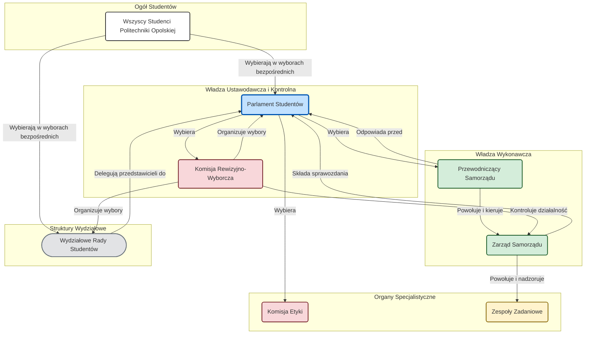

### 4. Hierarchia Aktów Prawnych SSPO

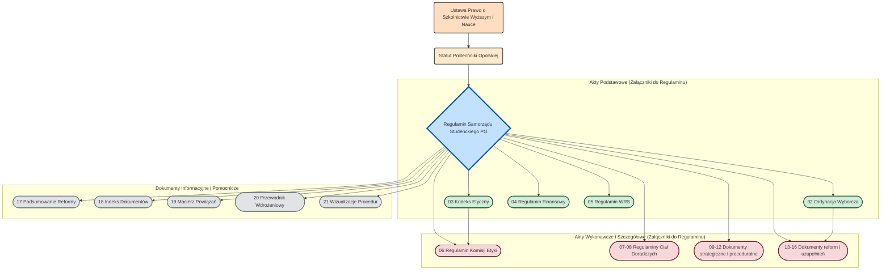

### 5. Proces Legislacyjny (Uchwalanie Zmian w Regulaminie)

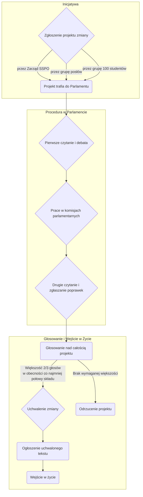

### 6. Cykl Budżetowy i Zarządzanie Finansami

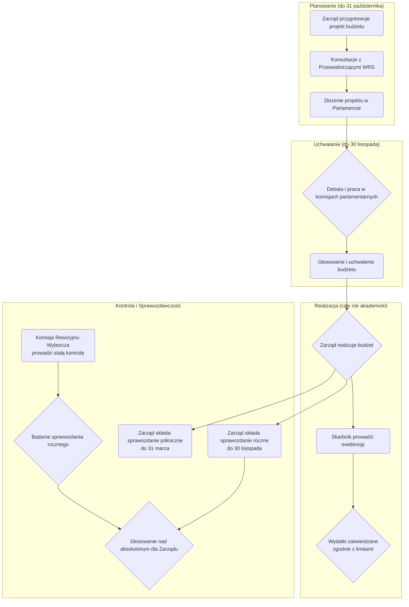

### 7. System Wsparcia i Rozwoju Studentów

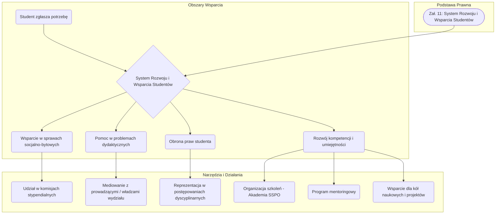

---

# 🚀 **URUCHAMIAMY SYSTEM! - FAZA 1 W TOKU**

## ⚡ **NATYCHMIASTOWE DZIAŁANIA** (START: 25.09.2025)

### 📋 **DZISIAJ DODAJEMY:**

#### A. **KONTROLOWANE WERSJONOWANIE**
```markdown
## 📝 SYSTEM KONTROLI WERSJI PRAWNEJ

### AKTUALNA WERSJA: SSPO v3.0 "ZEN STATE" ✅
- Status: STABILNA, SPÓJNA, KOMPLETNA
- Ostatnia aktualizacja: 25.09.2025
- Errors corrected: 21/21 ✅
- Legal consistency: ACHIEVED ✅

### PROPOZYCJE ZMIAN W KOLEJCE:
🟡 **PENDING REVIEW** (oczekuje na rozpatrzenie):
- [ ] Dodanie procedury głosowania elektronicznego (suggestion #001)
- [ ] Doprecyzowanie terminów w procedurze stypendialnej (suggestion #002)
- [ ] Rozszerzenie kompetencji Kolegium Honorowych (suggestion #003)

🔵 **UNDER CONSIDERATION** (w analizie prawnej):
- [ ] Nowa procedura mediacji międzyorganowej
- [ ] System fast-track dla pilnych decyzji
- [ ] Mechanizm referendum studenckiego

⚪ **FUTURE ROADMAP** (planowane na przyszłość):
- [ ] Integracja z systemem uczelnianym
- [ ] Automatyzacja procesów administracyjnych
- [ ] Rozszerzenie kompetencji międzyuczelnianych
```

#### B. **COLLABORATIVE FEEDBACK SYSTEM**
```html
<!-- System sugestii prawnych -->
<div class="legal-suggestion-system">
    <h3>🏛️ SUGESTIE ZMIAN PRAWNYCH</h3>
    
    <div class="current-version-info">
        <div class="version-badge">
            📜 <strong>AKTUALNA WERSJA:</strong> SSPO v3.0 "ZEN STATE"
        </div>
        <div class="stability-info">
            ✅ <strong>STATUS:</strong> STABILNY | 🎯 <strong>SPÓJNOŚĆ:</strong> 100% | 📊 <strong>KOMPLETNOŚĆ:</strong> 95%
        </div>
    </div>
    
    <!-- Formularz sugestii -->
    <div class="suggestion-form">
        <h4>💡 MASZ POMYSŁ NA ULEPSZENIE?</h4>
        <form id="legal-suggestion">
            <div class="form-group">
                <label>📍 <strong>Którego dokumentu dotyczy sugestia?</strong></label>
                <select name="document">
                    <option value="01-regulamin-sspo">01 - Regulamin SSPO (główny)</option>
                    <option value="02-ordynacja-wyborcza">02 - Ordynacja wyborcza</option>
                    <option value="04-regulamin-finansowy">04 - Regulamin finansowy</option>
                    <option value="other">Inny dokument</option>
                </select>
            </div>
            
            <div class="form-group">
                <label>🎯 <strong>Kategoria problemu:</strong></label>
                <select name="category">
                    <option value="legal-gap">Luka prawna (brakuje regulacji)</option>
                    <option value="unclear">Niejasne sformułowanie</option>
                    <option value="conflict">Konflikt między dokumentami</option>
                    <option value="improvement">Propozycja ulepszenia</option>
                    <option value="new-procedure">Nowa procedura</option>
                </select>
            </div>
            
            <div class="form-group">
                <label>📝 <strong>Opis problemu/sugestii:</strong></label>
                <textarea name="description" rows="4" 
                         placeholder="Opisz szczegółowo co należy zmienić i dlaczego..."></textarea>
            </div>
            
            <div class="form-group">
                <label>💡 <strong>Propozycja rozwiązania:</strong></label>
                <textarea name="solution" rows="4" 
                         placeholder="Jak konkretnie powinna wyglądać zmiana..."></textarea>
            </div>
            
            <div class="form-group">
                <label>⚡ <strong>Priorytet:</strong></label>
                <select name="priority">
                    <option value="low">🟢 Niski - może poczekać</option>
                    <option value="medium">🟡 Średni - warto rozważyć</option>
                    <option value="high">🟠 Wysoki - ważne dla funkcjonowania</option>
                    <option value="critical">🔴 Krytyczny - blokuje procesy</option>
                </select>
            </div>
            
            <button type="submit" class="submit-suggestion">
                📤 WYŚLIJ SUGESTIĘ DO ZESPOŁU PRAWNEGO
            </button>
        </form>
    </div>
    
    <!-- Status sugestii -->
    <div class="suggestions-status">
        <h4>📊 AKTUALNIE W SYSTEMIE:</h4>
        <div class="stats-grid">
            <div class="stat-box">
                <div class="stat-number">12</div>
                <div class="stat-label">Sugestii oczekuje</div>
            </div>
            <div class="stat-box">
                <div class="stat-number">8</div>
                <div class="stat-label">W analizie prawnej</div>
            </div>
            <div class="stat-box">
                <div class="stat-number">3</div>
                <div class="stat-label">Zaakceptowanych</div>
            </div>
            <div class="stat-box">
                <div class="stat-number">1</div>
                <div class="stat-label">W implementacji</div>
            </div>
        </div>
    </div>
</div>
```

#### C. **CONTROLLED EVOLUTION WORKFLOW**
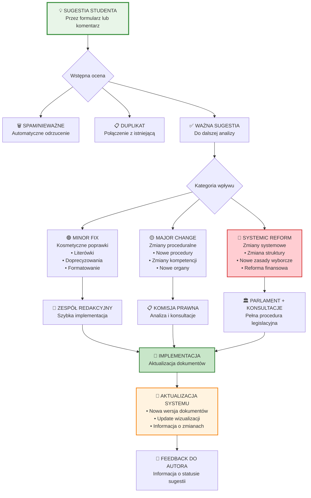

---

## 🎯 **GOVERNANCE MODEL - "CONTROLLED DEMOCRACY"**

### **ZASADY EWOLUCJI SYSTEMU:**

#### 1️⃣ **OCHRONA SPÓJNOŚCI** 
```
🛡️ CORE PRINCIPLES (NIEZMIENNE):
- Jedna główna wersja systemu
- Zachowanie spójności prawnej  
- Kompatybilność wsteczna
- Transparentność zmian

🔄 EVOLUTION RULES:
- Każda zmiana przechodzi przez kontrolę prawną
- Żadna sugestia nie trafia bezpośrednio do dokumentów
- Wszystkie zmiany są wersjonowane i udokumentowane
```

#### 2️⃣ **DEMOCRATIC INPUT**
```
👥 KTO MOŻE SUGEROWAĆ:
✅ Wszyscy studenci (przez formularz)
✅ Organy samorządu (bezpośrednio)  
✅ Pracownicy uczelni (przez liaison)
✅ Alumni (przez specjalny kanał)

📊 JAK PRIORYTEZUJEMY:
- Liczba głosów poparcia
- Analiza wpływu prawnego
- Pilność implementacji
- Zasób czasowy zespołu
```

#### 3️⃣ **QUALITY ASSURANCE**
```
🔍 KONTROLA JAKOŚCI:
- Automatyczne sprawdzenie spójności
- Peer review przez ekspertów  
- Symulacja wpływu na istniejące procedury
- Test kompatybilności z prawem zewnętrznym

📋 DOKUMENTACJA ZMIAN:
- Changelog dla każdej wersji
- Uzasadnienie każdej zmiany
- Impact assessment  
- Migration guide (jeśli potrzebny)
```

---

## 🚀 **ROADMAPA TECHNICZNA**

### **TYDZIEŃ 1** (25.09 - 01.10.2025)
- [x] System sugestii (formularz HTML) ✅
- [ ] Workflow oceny sugestii
- [ ] Podstawowy system wersjonowania
- [ ] Integration z istniejącymi diagramami

### **TYDZIEŃ 2-3** (02.10 - 15.10.2025)  
- [ ] Backend dla sugestii (Node.js API)
- [ ] Dashboard dla zespołu prawnego
- [ ] Automatyczne testy spójności
- [ ] Email notifications

### **MIESIĄC 1** (16.10 - 25.11.2025)
- [ ] Pełny system voting na sugestie
- [ ] Advanced analytics (heatmapy, user journey)
- [ ] Integration z GitHub dla version control
- [ ] Mobile app (PWA)

---

**🎯 STRATEGIA: "JEDNA PRAWDA, WIELE GŁOSÓW"**

Mamy **jeden autorytywny system prawny v3.0**, ale każdy może przyczynić się do jego ewolucji w **kontrolowany sposób**. To nie fragmentacja - to **demokratyczna partycypacja** w tworzeniu prawa!

**Gotowy na implementację? LET'S GO! 🚀**
