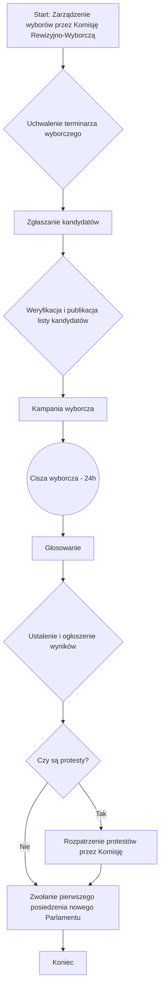
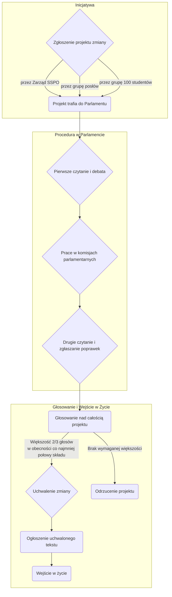
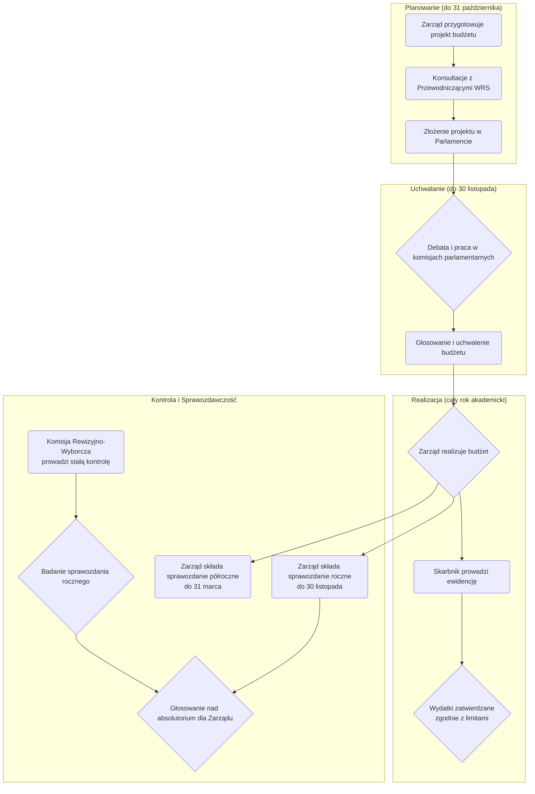

# WIZUALIZACJE PROCEDUR

*Załącznik nr 20 do [Regulaminu Samorządu Studenckiego Politechniki Opolskiej](01-regulamin-sspo.md)*

Ten dokument zawiera wizualne przedstawienie kluczowych procedur opisanych w systemie prawnym Samorządu Studenckiego Politechniki Opolskiej. Diagramy mają na celu ułatwienie zrozumienia złożonych procesów.

## 1. Procedura Wyborcza (na podstawie [Ordynacji Wyborczej](02-ordynacja-wyborcza.md))

Diagram przedstawia kolejne etapy wyborów do organów Samorządu, od ich zarządzenia aż do ukonstytuowania się nowych władz.



## 2. Postępowanie przed Komisją Etyki (na podstawie [Regulaminu Komisji Etyki](06-regulamin-komisji-etyki.md))

Diagram ilustruje ścieżkę postępowania w przypadku zgłoszenia naruszenia zasad etycznych przez członka organu Samorządu.

```mermaid
flowchart TD
    subgraph "Etap Wstępny"
        A[Start: Zgłoszenie naruszenia zasad etyki] --> B{Weryfikacja formalna wniosku};
        B -- Wniosek poprawny --> C{Wszczęcie postępowania};
        B -- Braki formalne --> D[Wezwanie do uzupełnienia braków];
    end

    subgraph "Postępowanie Wyjaśniające (do 30 dni)"
        C --> E[Zbieranie dowodów];
        E --> F[Wysłuchanie stron i świadków];
        F --> G[Analiza materiału dowodowego];
    end

    subgraph "Orzeczenie i Sankcje"
        G --> H{Wydanie orzeczenia};
        H -- Stwierdzono naruszenie --> I{Zastosowanie sankcji};
        H -- Brak naruszenia --> J[Zakończenie i umorzenie postępowania];
        I --> I1[1. Upomnienie];
        I --> I2[2. Zobowiązanie do przeprosin];
        I --> I3[3. Wniosek do Parlamentu o dalsze sankcje];
    end

    subgraph "Procedura Odwoławcza"
        I1 --> K{Czy strona składa odwołanie do Parlamentu? (14 dni)};
        I2 --> K;
        I3 --> K;
        K -- Tak --> L[Rozpatrzenie odwołania przez Parlament];
        K -- Nie --> M[Koniec: Orzeczenie jest ostateczne];
        L --> M;
        J --> M;
    end
```

## 3. Struktura Organizacyjna Samorządu Studenckiego (na podstawie [Regulaminu SSPO](01-regulamin-sspo.md))

Diagram przedstawia hierarchię oraz kluczowe relacje (wybór, powoływanie, kontrola) pomiędzy organami Samorządu Studenckiego Politechniki Opolskiej.


### 4. Hierarchia Aktów Prawnych SSPO


### 5. Proces Legislacyjny (Uchwalanie Zmian w Regulaminie)



### 6. Cykl Budżetowy i Zarządzanie Finansami



### 7. System Wsparcia i Rozwoju Studentów


