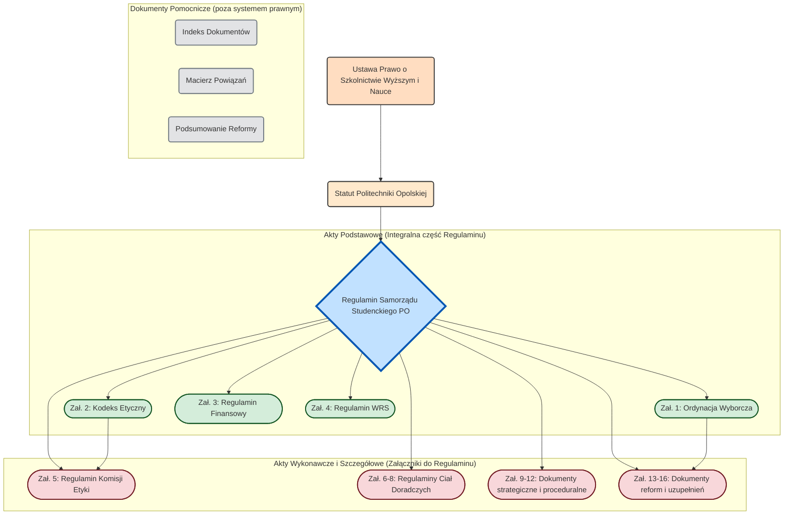

# WIZUALIZACJE PROCEDUR

*Załącznik nr 21 do [Regulaminu Samorządu Studenckiego Politechniki Opolskiej](01-regulamin-sspo.md)*

Ten dokument zawiera wizualne przedstawienie kluczowych procedur opisanych w systemie prawnym Samorządu Studenckiego Politechniki Opolskiej. Diagramy mają na celu ułatwienie zrozumienia złożonych procesów.

## 1. Procedura Wyborcza (na podstawie [Ordynacji Wyborczej](02-ordynacja-wyborcza.md))

Diagram przedstawia kolejne etapy wyborów do organów Samorządu, od ich zarządzenia aż do ukonstytuowania się nowych władz.


## 2. Postępowanie przed Komisją Etyki (na podstawie [Regulaminu Komisji Etyki](06-regulamin-komisji-etyki.md))

Diagram ilustruje ścieżkę postępowania w przypadku zgłoszenia naruszenia zasad etycznych przez członka organu Samorządu.

```mermaid
flowchart TD
    A[Start: Zgłoszenie naruszenia zasad etyki] --> B{Wszczęcie postępowania przez Komisję Etyki};
    B --> C[Postępowanie wyjaśniające (do 30 dni)];
    C --> D{Wydanie orzeczenia};
    D -- Stwierdzono naruszenie --> E{Zastosowanie sankcji};
    D -- Brak naruszenia --> F[Zakończenie postępowania];
    E --> G{Czy strona składa odwołanie do Parlamentu?};
    G -- Tak --> H[Rozpatrzenie odwołania przez Parlament];
    G -- Nie --> F;
    H --> F;
```

## 3. Struktura Organizacyjna Samorządu Studenckiego (na podstawie [Regulaminu SSPO](01-regulamin-sspo.md))

Diagram przedstawia hierarchię oraz kluczowe relacje (wybór, powoływanie, kontrola) pomiędzy organami Samorządu Studenckiego Politechniki Opolskiej.

```mermaid
graph TD;
    subgraph "Społeczność Studencka"
        A("Wszyscy Studenci Politechniki Opolskiej")
    end

    subgraph "Władza Ustawodawcza i Wyborcza"
        B(Parlament Studentów)
    end

    subgraph "Władza Wykonawcza"
        C(Przewodniczący Samorządu)
        D(Zarząd Samorządu)
    end

    subgraph "Organy Kontrolne i Etyczne"
        E(Komisja Rewizyjno-Wyborcza)
        F(Komisja Etyki)
    end
    
    subgraph "Struktury Wydziałowe"
        G([Wydziałowe Rady Studentów](05-regulamin-wrs.md))
    end

    A --"Wybierają w wyborach bezpośrednich"--> B;
    A --"Wybierają w wyborach bezpośrednich"--> G;
    
    B --"Wybiera w głosowaniu tajnym"--> C;
    B --"Powołuje na wniosek Przewodniczącego"--> D;
    B --"Wybiera"--> E;
    B --"Wybiera"--> F;

    C --"Kieruje pracami"--> D;
    
    E --"Kontroluje działalność"--> D;
    D --"Składa sprawozdania"--> B;
    C --"Odpowiada przed"--> B;

```

### 4. Hierarchia Aktów Prawnych SSPO



### 5. Proces Legislacyjny (Uchwalanie Zmian w Regulaminie)


### 6. Cykl Budżetowy i Zarządzanie Finansami


### 7. System Wsparcia i Rozwoju Studentów


