# INDEKS SYSTEMU REGULAMINOWEGO SAMORZĄDU STUDENCKIEGO POLITECHNIKI OPOLSKIEJ

## INFORMACJE OGÓLNE

# Nowy System Aktów Prawnych Samorządu Studenckiego Politechniki Opolskiej (wersja 3)

Ten projekt ma na celu stworzenie nowej, w pełni zintegrowanej i łatwej w nawigacji wersji dokumentów prawnych Samorządu Studenckiego Politechniki Opolskiej.

## Struktura

Wszystkie dokumenty znajdują się w formacie Markdown w katalogu `regulamin-v3`. Głównym plikiem jest `index.md`, który pełni rolę spisu treści i punktu wyjścia do nawigacji po całym systemie.

## Jak korzystać?

1.  Otwórz plik `index.md`, aby zobaczyć listę wszystkich dostępnych dokumentów.
2.  Klikaj na linki, aby przechodzić do poszczególnych regulaminów, procedur i innych aktów prawnych.
3.  Dzięki wewnętrznym hiperłączom możesz łatwo poruszać się pomiędzy powiązanymi ze sobą dokumentami.

## Cel projektu

*   **Zwiększenie przejrzystości:** Nowa struktura ma na celu ułatwienie dostępu do informacji i zrozumienie powiązań między dokumentami.
*   **Łatwość aktualizacji:** Format Markdown pozwala na prostą edycję i wersjonowanie dokumentów.
*   **Nowoczesność:** Stworzenie systemu na miarę XXI wieku, który będzie przyjazny dla użytkownika.

System składa się z dwudziestu jeden dokumentów prawnych stanowiących kompletną podstawę prawną funkcjonowania Samorządu.

## ZAWARTOŚĆ SYSTEMU

System obejmuje siedemnaście unikalnych dokumentów oznaczonych numeracją v2, cztery dokumenty główne w pełni zreformowane, jedenaście dokumentów pomocniczych poddanych konwersji językowej oraz dwa dokumenty informacyjne.

Łączny rozmiar dokumentacji wynosi dwieście trzydzieści kilobajtów.

## CHARAKTERYSTYKA WERSJI DRUGIEJ

System charakteryzuje się eliminacją duplikatów dokumentów, jednolitą konwencją nazewnictwa plików, uporządkowaną strukturą hierarchiczną, kompletnością regulacji prawnej oraz zaktualizowanym indeksem dokumentów.

## DOKUMENTY PODSTAWOWE

Regulamin Samorządu Studenckiego Politechniki Opolskiej - akt konstytucyjny określający organizację i funkcjonowanie Samorządu

Ordynacja Wyborcza Samorządu Studenckiego Politechniki Opolskiej - przepisy dotyczące wyborów do organów Samorządu

Kodeks Etyczny Samorządu Studenckiego Politechniki Opolskiej - normy etyczne obowiązujące członków organów

Regulamin Finansowy Samorządu Studenckiego Politechniki Opolskiej - zasady gospodarki finansowej

## DOKUMENTY WYKONAWCZE

Dokumenty zawierają szczegółowe procedury i regulacje wykonawcze do dokumentów podstawowych zgodnie z indeksem dokumentów systemu.

## INFORMACJE O REFORMIE

Data rozpoczęcia reformy: szesnasty sierpnia roku dwutysięcznego dwudziestego piątego
Data ukończenia reformy: siedemnasty sierpnia roku dwutysięcznego dwudziestego piątego

Niniejszy katalog stanowi wersję obowiązującą systemu regulaminowego.

## Diagram Struktury Dokumentów

Poniższy diagram przedstawia strukturę systemu prawnego SSPO, gdzie Regulamin Główny jest centralnym dokumentem, a pozostałe stanowią jego integralne załączniki.

```mermaid
graph TD;
    A[01 Regulamin SSPO] --> B[02 Ordynacja Wyborcza];
    A --> C[03 Kodeks Etyczny];
    A --> D[04 Regulamin Finansowy];
    A --> E[05 Regulamin WRS];
    A --> F[06 Regulamin Komisji Etyki];
    A --> G[07 Regulamin Kolegium Honorowych];
    A --> H[08 Regulamin Rady Doradczej];
    A --> I[09 Procedury Konsultacyjne];
    A --> J[10 Ceremoniał Honorowy];
    A --> K[11 Strategia Współpracy];
    A --> L[12 System Rozwoju];
    A --> M[13 Zabezpieczenia Systemowe];
    A --> N[14 Uzupełnione Procedury Wyborcze];
    A --> O[15 Uproszczenia Proceduralne];
    A --> P[16 Reforma Kadencyjna];
    A --> Q[17 Podsumowanie Reformy];
    A --> R[18 Indeks Dokumentów];
    A --> S[19 Macierz Powiązań];
    A --> T[20 Przewodnik Uchwalenia];
    A --> U[21 Wizualizacje Procedur];
```

## Jak korzystać z systemu?

1.  Otwórz plik `index.md`, aby zobaczyć listę wszystkich dostępnych dokumentów.
2.  Klikaj na linki, aby przechodzić do poszczególnych regulaminów, procedur i innych aktów prawnych.
3.  Dzięki wewnętrznym hiperłączom możesz łatwo poruszać się pomiędzy powiązanymi ze sobą dokumentami.

| Numer | Nazwa dokumentu                                       | Plik                                      |
|-------|-------------------------------------------------------|-------------------------------------------|
| 01    | Regulamin SSPO                                        | `01-regulamin-sspo.md`                   |
| 02    | Ordynacja Wyborcza                                   | `02-ordynacja-wyborcza.md`              |
| 03    | Kodeks Etyczny                                       | `03-kodeks-etyczny.md`                   |
| 04    | Regulamin Finansowy                                   | `04-regulamin-finansowy.md`              |
| 05    | Regulamin WRS                                        | `05-regulamin-wrs.md`                   |
| 06    | Regulamin Komisji Etyki                              | `06-regulamin-komisji-etyki.md`         |
| 07    | Regulamin Kolegium Honorowych                        | `07-regulamin-kolegium-honorowych.md`   |
| 08    | Regulamin Rady Doradczej                            | `08-regulamin-rady-doradczej.md`       |
| 09    | Procedury Konsultacyjne                              | `09-procedury-konsultacyjne.md`         |
| 10    | Ceremoniał Honorowy                                  | `10-ceremonial-honorowy.md`             |
| 11    | Strategia Współpracy                                 | `11-strategia-wspolpracy.md`            |
| 12    | System Rozwoju                                       | `12-system-rozwoju.md`                   |
| 13    | Zabezpieczenia Systemowe                             | `13-zabezpieczenia-systemowe.md`        |
| 14    | Uzupełnione Procedury Wyborcze                      | `14-uzupelnione-procedury-wyborcze.md`  |
| 15    | Uproszczenia Proceduralne                            | `15-uproszczenia-proceduralne.md`      |
| 16    | Reforma Kadencyjna                                   | `16-reforma-kadencyjna.md`              |
| 17    | Podsumowanie Reformy                                 | `17-podsumowanie-reformy.md`            |
| 18    | Indeks Dokumentów                                    | `18-indeks-dokumentow.md`                |
| 19    | Macierz Powiązań Dokumentów                          | `19-macierz-powiazan.md`                  |
| 20    | Przewodnik Uchwalenia Systemu                        | `20-przewodnik-uchwalenia.md`             |
| 21    | Wizualizacje Procedur                                | `21-procedury-wizualizacje.md`            |
